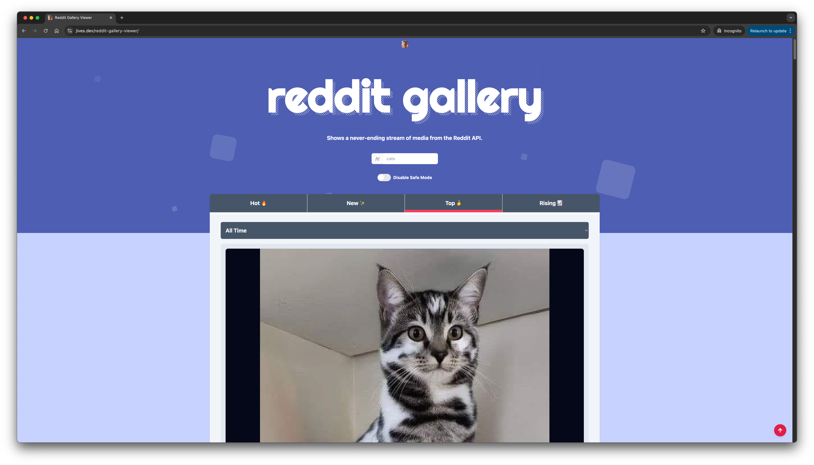

# Reddit Gallery Viewer

Shows a never-ending stream of images from the Reddit API. Created with <a href="https://angular.io/">Angular</a> and <a href="https://rxjs.dev/">RxJS</a> using the <a href="https://www.reddit.com/dev/api/">Reddit API</a>.
This was primarily created as a demo to showcase the usage of virtual scrolling combined with API driven content.

Special thank you to all the past and present [GitHub Sponsors](https://github.com/sponsors/JamesIves) 💖.

<!-- sponsors -->&nbsp;&nbsp;&nbsp;&nbsp;&nbsp;&nbsp;&nbsp;&nbsp;&nbsp;&nbsp;&nbsp;&nbsp;&nbsp;&nbsp;&nbsp;&nbsp;&nbsp;&nbsp;&nbsp;&nbsp;&nbsp;&nbsp;&nbsp;&nbsp;&nbsp;&nbsp;&nbsp;&nbsp;&nbsp;&nbsp;&nbsp;&nbsp;&nbsp;&nbsp;&nbsp;&nbsp;&nbsp;&nbsp;&nbsp;&nbsp;&nbsp;&nbsp;&nbsp;&nbsp;<!-- sponsors -->

## Getting Started

> [!TIP]
> You can [try a hosted version the application here](https://jives.dev/reddit-gallery-viewer).

You can run the application locally by running `npm install` followed by `npm start`. You can then [view the application locally on port 4200](http://localhost:4200). The Reddit API does not (at the time of writing this) require any sort of client credentials, so there's no additional setup needed there.

### Tests and Linting

You can run the linting and testing scripts by running `npm run lint` and `npm run test`. You can also format the project directly using Prettier by running `npm run lint:format`.

